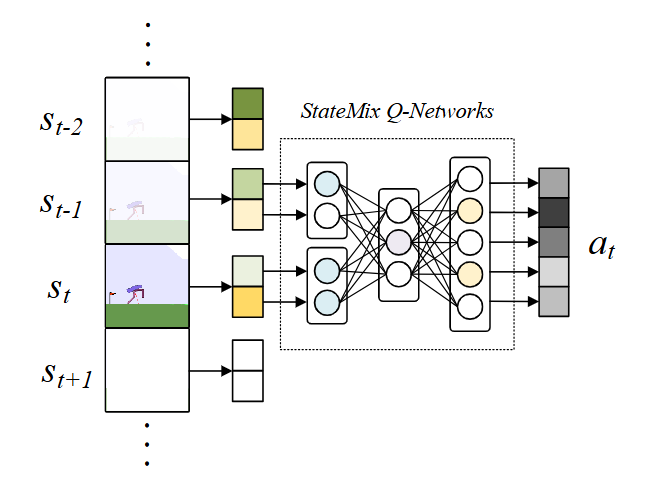
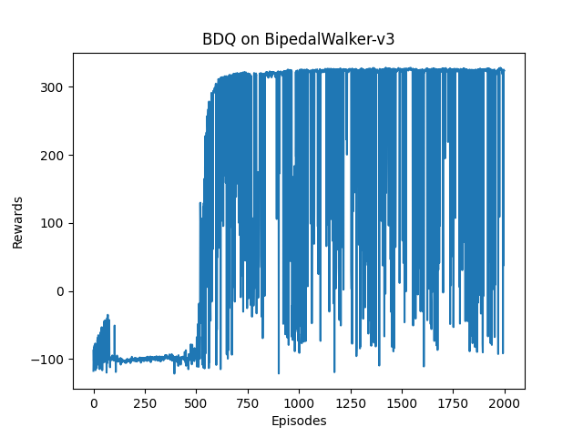

# StateMix
StateMix is a simple and efficient variant of DQN for DRL in large action space.

> To test our proposal in the environments of gym, where there are multiple action dimensions, we integrate it with Branching DQN, whose implementation is based on https://github.com/seolhokim/BipedalWalker-BranchingDQN. 


## Transition-aware Q-Networks



Instead of estimating Q-values based only on the current state $s_t$ like DQN, **StateMix** conditions the Q-function on the transition pair $(s_{t-1}, s_t)$ and the action $a_t$, resulting in a new formulation $Q(s_{t-1}, s_t, a_t)$. This design allows the agent to leverage recent history and infer implicit dynamics from transitions, leading to improved training efficiency and more effective policy learning.

**StateMix** remains fully compatible with the DQN training pipeline, including experience replay and target networks, while introducing only minimal architectural changes. Unlike methods that rely on RNN or other memory mechanisms to store historical information, **StateMix** avoids the added complexity and training cost of such components. 


## Dependencies
python \=\= 3.7.0  
gym \=\= 0.18.3  
mujoco \=\= 2.2.0  
torch \=\= 1.8.1  
*Other versions may also work well. It's just a reference.*  
  
## Train
use:

```bash
python train.py
```

- **--round | -r :** training rounds (default: 2000)
- **--lr_rate | -l :** learning rate (default: 0.0001)
- **--batch_size | -b :** batch size (default: 64)
- **--gamma | -g :** discounting factor gamma (default: 0.99)
- **--action_scale | -a :** discrete action scale among the continuous action space (default: 25)
- **--env | -e :** environment to train in (default: BipedalWalker-v3)
- **--load | -l :** to specify the model to load in ./model/ (e.g. 25 for [env]_25.pth)  
- **--tenacious | -t :** whether to make the agent tenacious with low reward (default: False)  
- **--save_interval | -s :** interval round to save model (default: 1000)
- **--print_interval | -d :** interval round to print evaluation (default: 200)


## Test
use:
```bash
python test.py
```

- **--not_render | -n :** not to render
- **--round | -r :** evaluation rounds (default: 10)
- **--action_scale | -a :** discrete action scale, specifying network to load in ./model/ (default: 25)  
- **--env | -e :** environment to test in (default: BipedalWalker-v3)

## Performance

The performance of **StateMix** is evaluated in the BipedalWalker-v3 environment, which has a continuous action space with 4 dimensions. The agent is trained for 2000 episodes, and the results are shown below.

